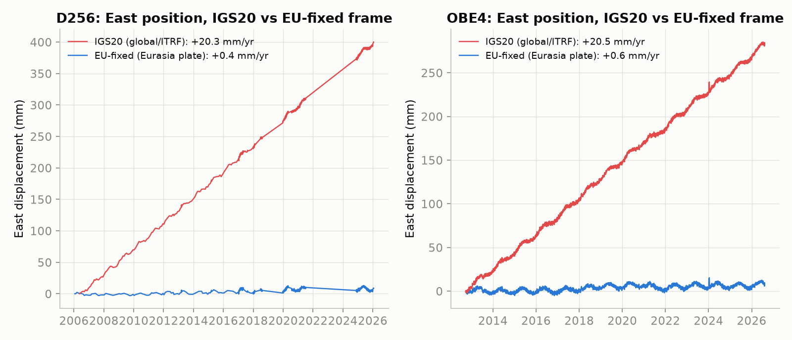
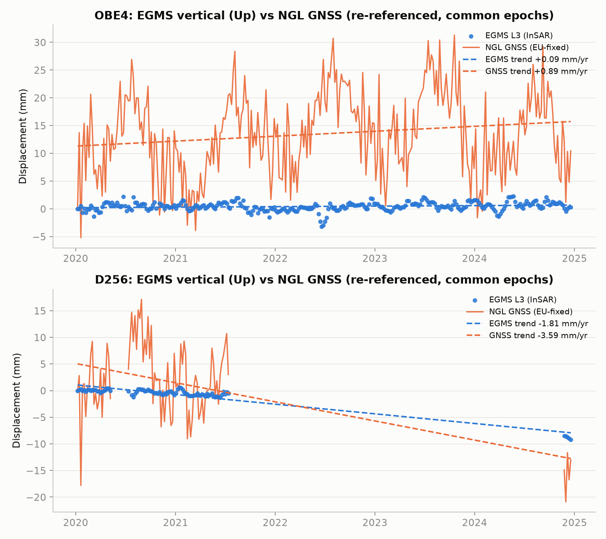
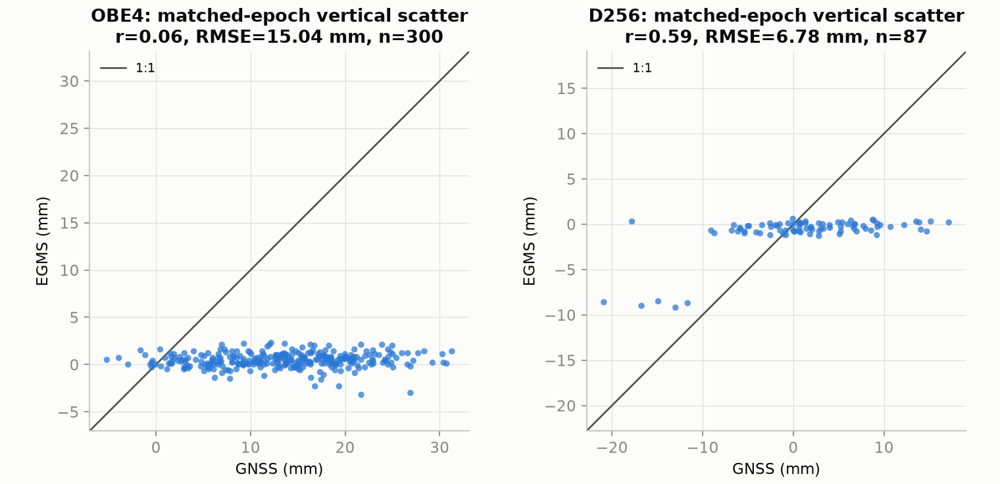
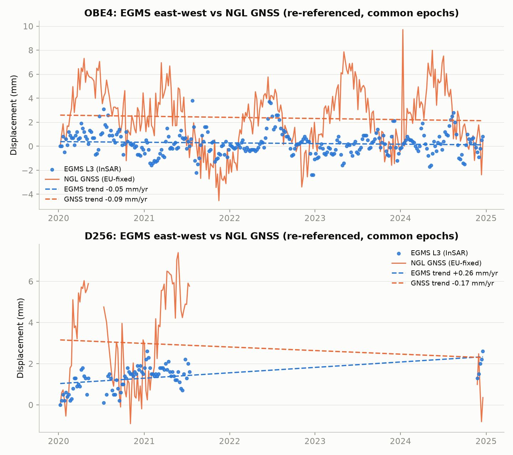
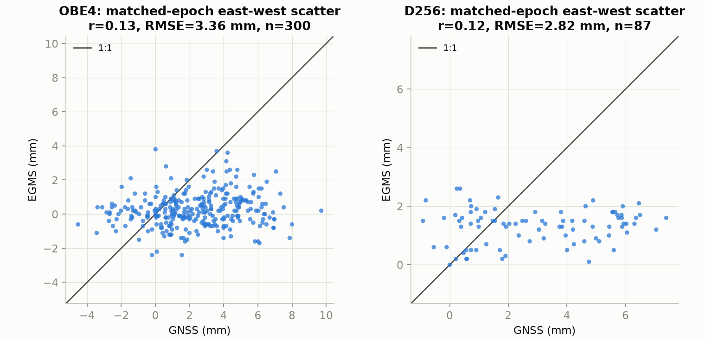
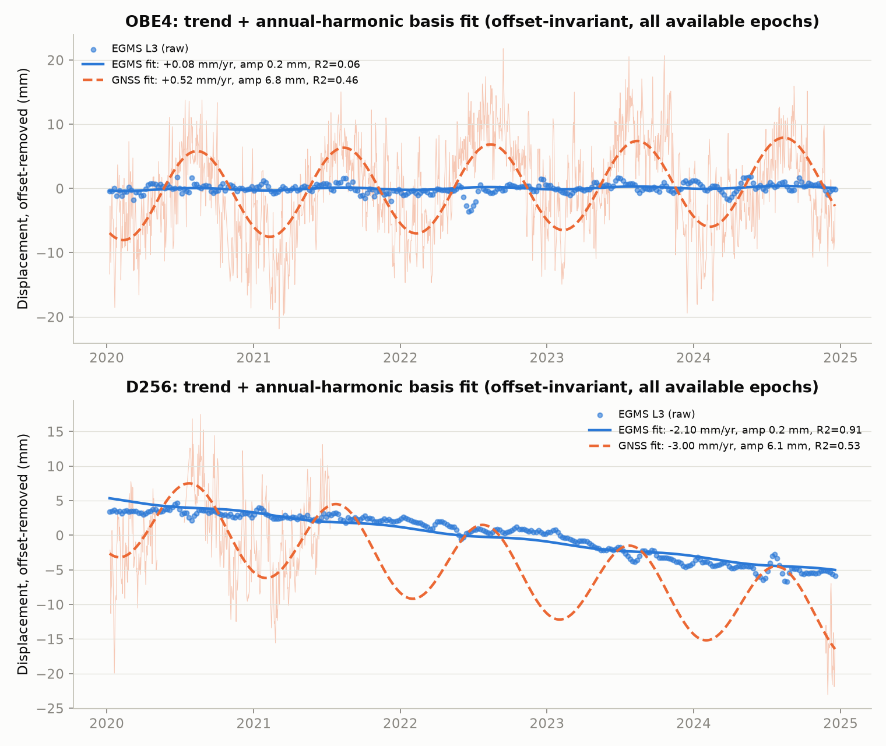
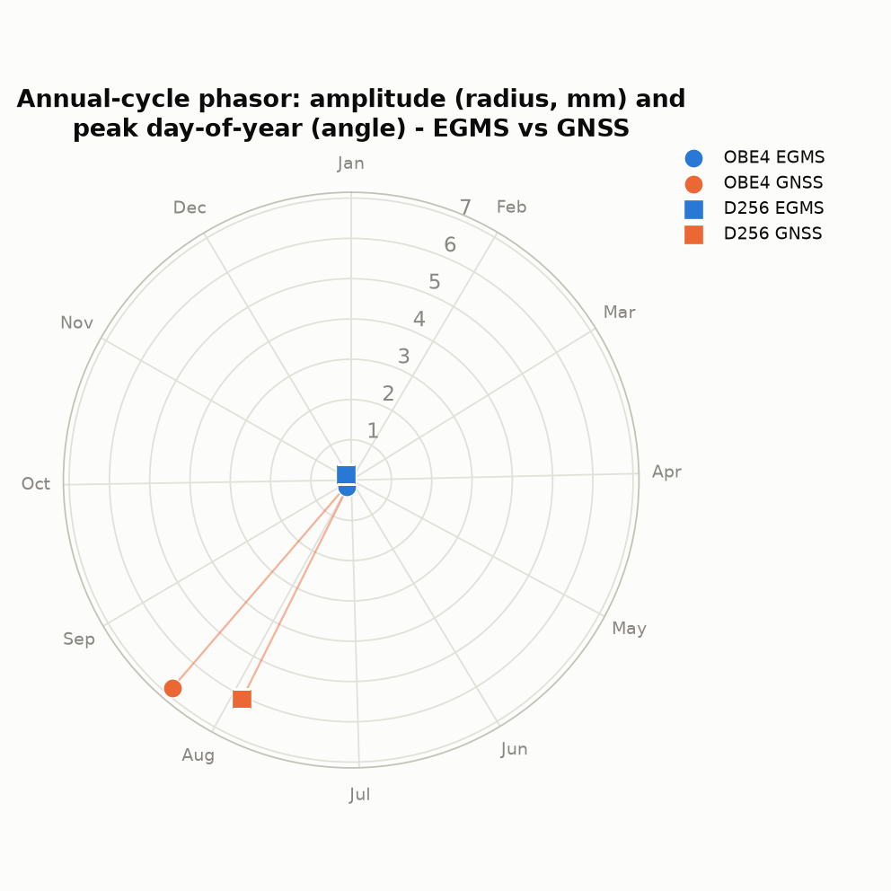

# EGMS L3 (ortho) vs NGL GNSS — Munich area

## Objective

Compare EGMS L3 "ortho" InSAR displacement time series (vertical + east-west
components, decomposed/orthorectified product) against Nevada Geodetic
Laboratory (NGL) GNSS position time series, for two stations near Munich,
Germany, and quantify agreement (Pearson r, RMSE, velocity/trend and trend
difference).

## Data sources

| Data | Source | Local path |
|---|---|---|
| EGMS L3 vertical (Up) | `EGMS_L3_E44N27_100km_U_2020_2024_1.csv`, inside `EGMS_ortho_up.zip` | `/dss/dsshome1/0C/di54haf/test_egms/egms_density_test/data/EGMS_ortho_up.zip` |
| EGMS L3 east-west | `EGMS_L3_E44N27_100km_E_2020_2024_1.csv`, inside `EGMS_ortho_east.zip` | `/dss/dsshome1/0C/di54haf/test_egms/egms_density_test/data/EGMS_ortho_east.zip` |
| NGL GNSS, Eurasia-fixed frame (EU) | `https://geodesy.unr.edu/gps_timeseries/IGS20/tenv3/EU/OBE4.EU.tenv3`, `.../D256.EU.tenv3` | `test/data/OBE4.EU.tenv3`, `test/data/D256.EU.tenv3` |
| NGL GNSS, global ITRF frame (IGS20) | `https://geodesy.unr.edu/gps_timeseries/IGS20/tenv3/IGS20/OBE4.tenv3`, `.../D256.tenv3` | `test/data/OBE4.IGS20.tenv3`, `test/data/D256.IGS20.tenv3` |

Both EGMS CSVs are ~250MB uncompressed and were streamed directly out of the
zip archives with `pandas.read_csv(..., chunksize=50000)` (see
`test/extract_egms_pixels.py`) rather than loaded whole. All NGL downloads
used `https://` (plain `http://` to geodesy.unr.edu times out on this HPC
node).

## Why the Eurasia-fixed (EU) GNSS frame, not IGS20

NGL publishes station time series in several reference frames. `IGS20` is a
global/ITRF-aligned frame and therefore includes the full rigid tectonic
motion of the Eurasian plate the station sits on (~2 cm/yr horizontally).
EGMS is referenced to ETRS89, which is *defined* to be co-moving with, and
therefore fixed relative to, the stable Eurasian plate — plate motion is
deliberately not present in EGMS displacements. Comparing EGMS to an IGS20
GNSS series would therefore compare a plate-motion-free series against one
dominated by a ~2 cm/yr secular drift that has nothing to do with local
ground deformation.

This was verified directly rather than assumed: the East-position time
series were plotted in both frames for both stations
(`figs/plate_motion_frames.png`), and independent linear trends fit to each:

| Station | East trend, IGS20 (mm/yr) | East trend, EU-fixed (mm/yr) | Plate motion removed (mm/yr) |
|---|---|---|---|
| D256 | +20.34 | +0.43 | 19.92 |
| OBE4 | +20.46 | +0.62 | 19.84 |

The IGS20 series shows a strong, essentially linear ~20 mm/yr eastward
drift consistent with the expected Eurasian-plate rotation rate at this
latitude; the EU-fixed series for the same station shows only a small
residual trend (<1 mm/yr), consistent with near-zero local deformation.
This confirms the EU-fixed tenv3 product is the correct choice for
comparison against EGMS, and that using IGS20 instead would have produced
a spurious multi-centimeter-per-year "trend difference" driven entirely by
reference-frame choice, not ground motion.

## Station selection

Two NGL stations were identified inside the EGMS L3 tile covering Munich:

- **OBE4** (48.0848°N, 11.2779°E, DLR Oberpfaffenhofen, ~20 km SW of central
  Munich) — near-daily, essentially gap-free NGL coverage from 2012 through
  2026. Used as the **primary** comparison station.
- **D256** (48.1411°N, 11.5901°E, central Munich) — has a genuine, complete
  data gap for all of 2022 and 2023 (zero NGL solutions those two years);
  only ~448 solutions total over 2020–2025, concentrated in 2020–2021 with a
  small fragment in late 2024. Used only as a **secondary/opportunistic**
  comparison, explicitly because it is more central to the city and
  therefore of interest despite the gap — its results should not be given
  the same weight as OBE4's.

## Method

1. Station lat/lon converted to EPSG:3035 (pyproj) and matched to the
   nearest EGMS L3 pixel in both the vertical and east CSVs by streaming
   through the ~250 MB files in 50k-row chunks and tracking the minimum
   distance. The same `pid` was recovered independently from both files for
   both stations, confirming grid consistency between the two components.
2. The matched pixel's full displacement time series (mm, dates
   2020-01-08 to 2024-12-18) was extracted for each component.
3. GNSS East/North/Up were read from the EU-fixed tenv3 files and converted
   m -> mm.
   **Added QC step** (see Limitations): raw NGL daily solutions contained a
   small but non-negligible fraction of clearly anomalous single-epoch
   values — jumps of tens of mm against ~5 mm formal sigma, physically
   implausible for a geodetic monument in one day. These were flagged with
   a standard robust outlier test (modified Z-score against a 15-observation
   rolling median, threshold 3.5 — Iglewicz & Hoaglin) and dropped, applied
   identically to every station and every component (East, North, Up) before
   any comparison. This removed 286/4981 OBE4 epochs (5.7%) and 56/1150
   D256 epochs (4.9%) from the full station history.
4. Epoch matching: EGMS dates (irregular, ~6–12 day sampling) were matched
   to the nearest GNSS epoch within a ±3 day tolerance
   (`pandas.merge_asof(..., direction="nearest", tolerance="3D")`). This was
   chosen over interpolation because GNSS is near-daily for OBE4 (matches
   trivially) and because, for D256, it naturally leaves epochs unmatched
   during the 2022–2023 gap rather than interpolating fabricated values
   across a >1-year hole.
5. Re-referencing: both matched series were shifted so their value at the
   first common (matched) epoch is zero, making them comparable in relative
   mm despite starting from different arbitrary absolute references.
6. Pearson r and RMSE were computed on the matched, re-referenced pairs;
   independent linear trends (mm/yr, `scipy.stats.linregress` vs decimal
   year) were fit to the EGMS and GNSS series separately over the common
   matched window.

## Results

| Station | Component | r | RMSE (mm) | EGMS trend (mm/yr) | GNSS trend (mm/yr) | Trend diff (mm/yr) | n matched / n EGMS | EGMS pixel–station dist. (m) |
|---|---|---|---|---|---|---|---|---|
| OBE4 | Vertical | 0.06 | 15.04 | +0.09 | +0.89 | −0.80 | 300 / 302 | 44.7 |
| D256 | Vertical | 0.59 | 6.78 | −1.81 | −3.59 | +1.78 | 87 / 302 | 51.6 |
| OBE4 | East-west | 0.13 | 3.36 | −0.05 | −0.09 | +0.04 | 300 / 302 | 44.7 |
| D256 | East-west | 0.12 | 2.82 | +0.26 | −0.17 | +0.44 | 87 / 302 | 51.6 |

Both EGMS pixels are 45–52 m from their respective stations, well inside the
~100 m EGMS L3 pixel spacing, so no flag is raised on spatial matching.

D256's time-series plot deliberately does not connect a line across the
2022–2023 gap — the GNSS curve visibly stops in mid-2021 and resumes only
near the end of 2024.

### Interpreting the OBE4 vs D256 difference

The two stations behave very differently, and this is physically
explicable, not a data-quality inconsistency between them:

- At **OBE4**, EGMS shows almost no vertical deformation (fitted trend
  +0.09 mm/yr, matched series scatter ~±2 mm) — consistent with it being a
  geodetically stable reference-quality site. GNSS Up, even after outlier
  removal, retains ~7 mm day-to-day scatter with a visible quasi-annual
  oscillation of ~10–20 mm peak amplitude (visible in
  `figs/timeseries_vertical.png`), a pattern typical of hydrological/thermal
  vertical loading signal that is a well-known feature of GNSS vertical
  time series and to which EGMS (regularised, spatially averaged InSAR with
  its own atmospheric correction) is far less sensitive. With essentially no
  real common deformation signal and GNSS noise/loading amplitude several
  times larger than the EGMS signal, a near-zero correlation (r=0.06) is the
  expected outcome, not evidence of a processing error.
- At **D256**, EGMS shows a real subsidence signal (−1.8 mm/yr) large enough
  to be visible against GNSS's noise floor, and indeed r rises to 0.59 with
  the two series broadly agreeing on both sign and rough magnitude of
  subsidence (GNSS trend −3.6 mm/yr).

East-west correlations are weak at both stations (r=0.12–0.13); this is
consistent with both stations having near-zero true horizontal deformation
in the EU-fixed frame, so — as at OBE4's vertical — there is very little
real common signal for GNSS and EGMS to agree on beyond their respective
noise floors.

## Limitations

- **Not a fully independent validation.** The EGMS CSVs carry
  `gnss_velocity_n/e/u` columns, meaning EGMS's own L3 processing already
  performs some internal GNSS-based referencing/calibration. This
  comparison is therefore not a strictly independent InSAR-vs-GNSS check,
  particularly for the velocity/trend numbers — the SAR the EGMS processor
  used may already have been partly tied to GNSS. The comparison against a
  specific external station (OBE4/D256, not necessarily among the stations
  EGMS's processor used) and the shape/timing agreement of the time series
  are still a meaningful, largely independent check, but this caveat should
  be kept in mind especially when interpreting the trend numbers.
- **GNSS outlier removal was necessary and is disclosed above**, not hidden:
  raw NGL daily solutions included clear single-epoch artifacts (up to
  ~100 mm on OBE4, formal sigma ~5 mm); a uniform robust filter was applied
  to all stations/components before any comparison.
- **D256's 2022–2023 gap** means its statistics rest on only 87 matched
  epochs concentrated in 2020–2021 plus a handful in late 2024, not an even
  5-year span; the D256 trend estimates in particular should be treated as
  indicative rather than precise.
- **Epoch matching** used nearest-within-3-days rather than interpolation;
  this is simple and avoids fabricating values across the D256 gap, but
  means each comparison point pairs an EGMS date with a GNSS date up to 3
  days away, adding some epoch-mismatch noise on top of measurement noise.
- **EGMS sampling is sparse and irregular** (~6–12 days) compared to GNSS,
  so the matched-epoch RMSE/r reflect a small sample of the continuous GNSS
  signal, not a fully continuous comparison.
- Vertical GNSS noise (several mm/day, with an apparent seasonal loading
  signal at OBE4) is large relative to the real deformation signal at the
  more stable of the two stations, which mechanically limits the achievable
  correlation there regardless of EGMS quality — see discussion above.

## Addendum: comparing fitted basis coefficients instead of raw epochs

The epoch-level comparison above is sensitive to GNSS's daily noise floor,
and depends on picking one shared reference epoch to zero both series
against. As a more robust alternative, this section fits the **same**
trend + annual-harmonic trajectory model independently to the EGMS series
and to the GNSS series (all available epochs in each, not just matched
ones), and compares the fitted **coefficients** — trend (mm/yr), annual
amplitude (mm), annual phase (peak day-of-year) — instead of comparing
individual displacement values. This is offset-reference-invariant (trend
and harmonic coefficients don't depend on where either series happens to
start), and each coefficient is estimated from hundreds to thousands of
points, averaging down GNSS's daily scatter far more than any single-epoch
comparison can.

Model: `value(t) = offset + trend·(t−t₀) + c·cos(2π(t−t₀)) + s·sin(2π(t−t₀))`,
fit by ordinary least squares, `t₀` = each series' own mean epoch. Annual
amplitude = `√(c²+s²)`; peak day-of-year derived from `atan2(s,c)` (verified
against a brute-force grid search of the fitted curve, not just the
closed-form formula).

### Sanity check against EGMS's own self-reported trend

EGMS's L3 CSV already reports its own `mean_velocity` per pixel. Refitting
independently with the method above reproduces it almost exactly, which is
a good internal check that the fitting code is doing what EGMS's own
processing does:

| Station | This fit's EGMS trend (mm/yr) | EGMS's self-reported `mean_velocity` (mm/yr) |
|---|---|---|
| OBE4 | +0.08 | +0.10 |
| D256 | −2.10 | −2.10 |

### Basis coefficients, EGMS-fit vs GNSS-fit

| Station | Method | n obs | Trend (mm/yr) | Annual amp (mm) | Annual peak | R² |
|---|---|---|---|---|---|---|
| OBE4 | EGMS | 302 | +0.08 ± 0.03 | 0.20 ± 0.09 | ~Aug 5 | 0.06 |
| OBE4 | GNSS | 1665 | +0.52 ± 0.09 | 6.80 ± 0.26 | ~Aug 12 | 0.46 |
| D256 | EGMS | 302 | −2.10 ± 0.04 | 0.20 ± 0.11 | ~Nov 19 | 0.91 |
| D256 | GNSS | 429 | −3.00 ± 0.23 | 6.07 ± 0.50 | ~Jul 29 | 0.53 |

The R² column is itself informative: at OBE4, trend+annual explains only
6% of EGMS's own variance — there is essentially nothing structured left to
explain, consistent with a geodetically stable site — while it explains 46%
of GNSS's variance, because GNSS carries a real, repeatable ~7mm seasonal
loading cycle that has nothing to do with ground deformation. At D256, the
strong secular trend makes EGMS very well explained by this simple model
(R²=0.91); GNSS's R² there (0.53) is lower mainly because of the
2022–2023 gap.

### EGMS-fit vs GNSS-fit comparison, and EGMS's internal GNSS calibration

| Station | Trend diff (mm/yr) | Annual amp ratio (GNSS/EGMS) | Annual phase diff (days) | EGMS's own internal `gnss_velocity_u` (mm/yr) | External NGL GNSS trend (mm/yr) |
|---|---|---|---|---|---|
| OBE4 | −0.44 | 33.4× | −6.9 | −0.4 | +0.52 |
| D256 | +0.90 | 29.9× | +113.6 (not meaningful — see caveat) | −0.3 | −3.00 |

The annual-amplitude ratio (~30×, both stations) is the cleanest number
here: GNSS Up's real, repeatable seasonal signal is about 30 times larger
than anything present in EGMS's vertical series at the same locations. This
is a direct, quantified version of the earlier qualitative point — EGMS
(regularised, spatially-averaged InSAR with its own atmospheric correction)
is far less sensitive to the hydrological/thermal loading that dominates
single-point GNSS Up, which is *good* for the query-anywhere model (it is
very unlikely to inherit this artifact from EGMS-derived training data) but
also means **GNSS's seasonal amplitude/phase is not a fair target for the
model to reproduce**, and epoch-level CRPS/PICP against raw GNSS Up will be
dominated by this GNSS-only signal rather than by model quality.

**Caveat on the phase numbers:** EGMS's own annual amplitude (0.20mm) is
only ~2× its own standard error at both stations — a marginal detection at
best, essentially fitting a harmonic to near-noise. The D256 phase
difference (+113.6 days) should **not** be read as "EGMS and GNSS disagree
on seasonal timing" — EGMS barely has a fittable seasonal signal there to
have a phase at all. Only the trend and (cautiously) the amplitude-ratio
numbers should be treated as meaningful; the phase comparison is included
for completeness/transparency, not as a result to lean on.

### Implication for the thesis validation plan (§8)

This supports the recommendation from the discussion preceding this test:
lead with **trend/velocity difference** as the primary GNSS-validation
metric (it reproduces EGMS's own self-reported velocity almost exactly and
is far less sensitive to GNSS noise than epoch-level comparison), use
**annual-amplitude ratio** as a secondary diagnostic of how much
deformation-irrelevant GNSS noise is present at a given station (a large
ratio flags a station where epoch-level/CRPS agreement will be
structurally limited regardless of model quality, independent of whether
that station is used for validation), and avoid over-interpreting
raw-epoch correlation, RMSE, or seasonal-phase agreement at stations where
this diagnostic shows EGMS itself has little to no detectable seasonal or
day-to-day signal to correlate against.

## Code and outputs

- `test/extract_egms_pixels.py` — streams the two EGMS CSVs, finds nearest
  pixel per station, saves `test/data/egms_matched_up.csv` and
  `egms_matched_east.csv`.
- `test/analysis.py` — loads GNSS + matched EGMS pixels, despikes GNSS,
  matches epochs, computes r/RMSE/trends, produces all figures in
  `test/figs/` and `test/data/comparison_results.csv` /
  `test/data/plate_motion_results.csv`.
- `test/basis_coefficient_validation.py` — fits trend+annual-harmonic basis
  models to EGMS and GNSS independently, compares coefficients, produces
  `test/figs/basis_fit_overlay.png` / `annual_phasor.png` and
  `test/data/basis_coefficients.csv` / `basis_coefficient_comparison.csv`.
- `test/pyproject.toml` — dedicated uv-managed project/venv for this task
  (numpy, pandas, matplotlib, scipy, pyproj, requests).
